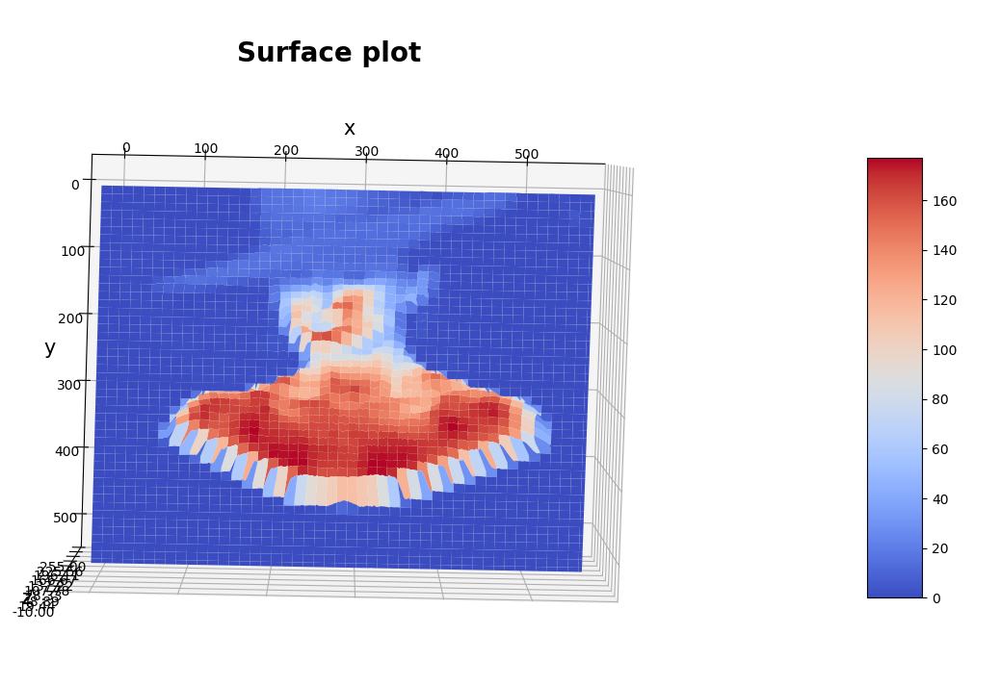
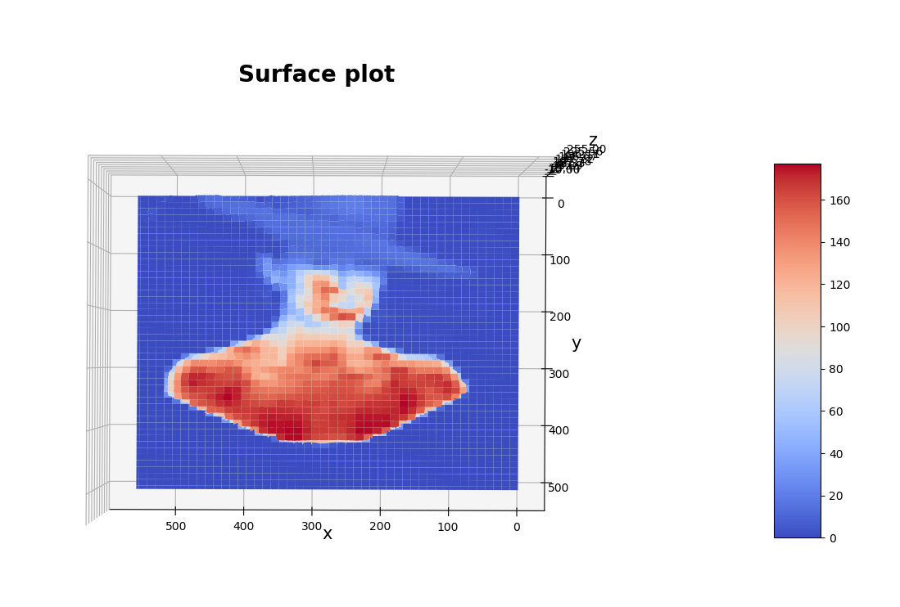
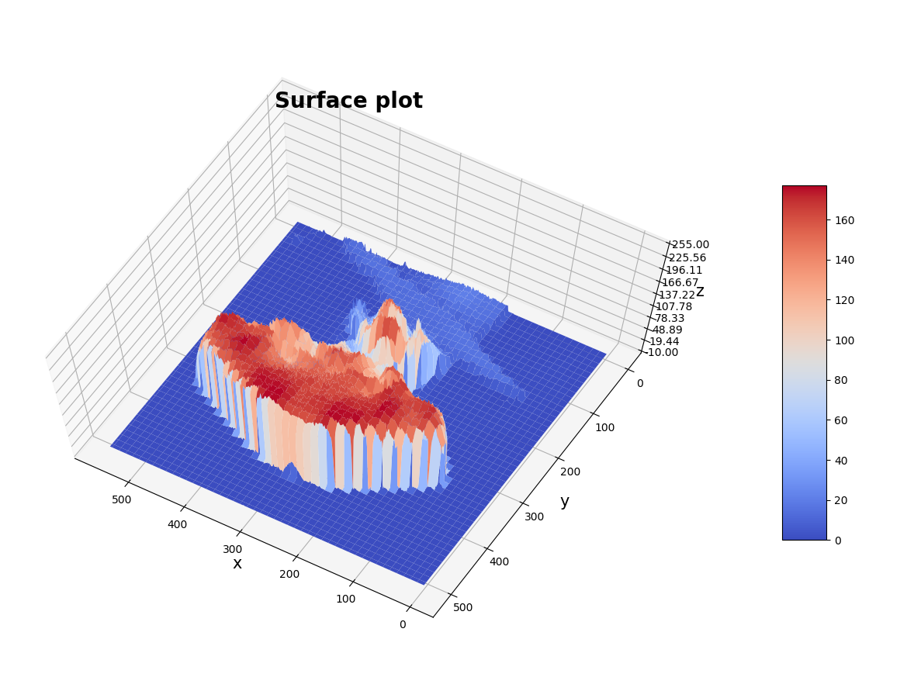

> python 3.6 + opencv

输入图片转为灰度图，使用numpy将其转化为数字矩阵
用matplot将矩阵在三维空间中绘制出来

输入图片：


输出效果：
俯视


仰视

侧面看




代码如下：
```
# -*- coding: utf-8 -*-
import numpy as np
import cv2 as cv
import matplotlib.pyplot as plt
from mpl_toolkits.mplot3d import Axes3D
from matplotlib import cm
from matplotlib.ticker import LinearLocator, FormatStrFormatter

fig = plt.figure(figsize=(16,12))
ax = fig.gca(projection="3d")

img = cv.imread("tina.jpg")		# 修改图片位置
img = cv.cvtColor(img,cv.COLOR_BGR2GRAY)
imgd = np.array(img)      # image类 转 numpy

# 准备数据
sp = img.shape
h = int(sp[0])#height(rows) of image
w = int(sp[1])#width(colums) of image

x = np.arange(0,w,1)
y = np.arange(0,h,1)
x,y = np.meshgrid(x,y)
z = imgd
surf = ax.plot_surface(x, y, z, cmap=cm.coolwarm)  # cmap指color map

# 自定义z轴
ax.set_zlim(-10, 255)
ax.zaxis.set_major_locator(LinearLocator(10))  # z轴网格线的疏密，刻度的疏密，20表示刻度的个数
ax.zaxis.set_major_formatter(FormatStrFormatter('%.02f'))  # 将z的value字符串转为float，保留2位小数

# 设置坐标轴的label和标题
ax.set_xlabel('x', size=15)
ax.set_ylabel('y', size=15)
ax.set_zlabel('z', size=15)
ax.set_title("Surface plot", weight='bold', size=20)

# 添加右侧的色卡条
fig.colorbar(surf, shrink=0.6, aspect=8)  # shrink表示整体收缩比例，aspect仅对bar的宽度有影响，aspect值越大，bar越窄
plt.show()
```

源码地址：[GitHub](https://github.com/yefcion/OpenCV-VS/tree/master/python-cv)
CSDN下载地址：[源码+图片](https://download.csdn.net/download/yefcion/10524135)