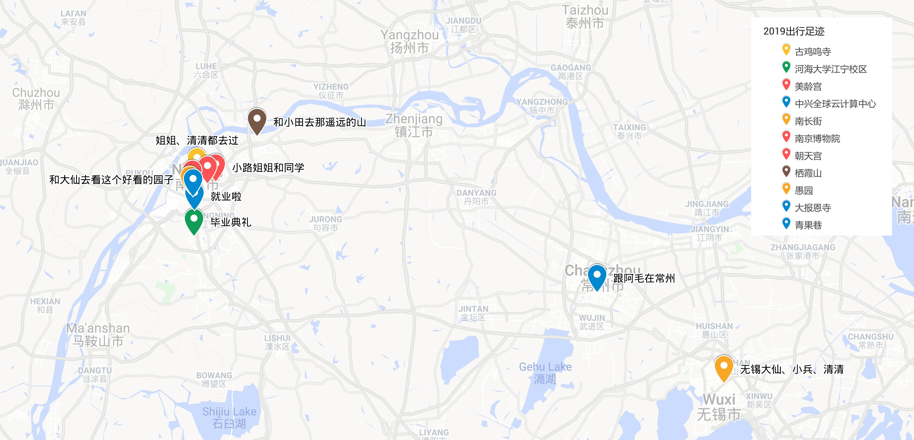

## 写在前面

2019 年渐入尾声

### Todo

格志日记的贴图排行

选出最满意的照片

记账数据统计

小米运动

- 体重
- 睡眠

## 正文

### 数据

- 读书 - 36 本，字数 659.55W
- 影视 - 492 部，去掉补标应该有 300 部
- 摄影 - 每日一记
- 出行 - 沪宁锡常
- 体重 - 均
- 睡眠
  - 入睡时间：
  - 睡眠时长：
- 消费
  - 年总：
  - 月均：
  - 数码：
- 收入
  - 年总：
  - 月均：

#### 读书统计

#### 观影统计

#### 每日一记

#### 出行足迹

#### 格志日记

### 推荐

- 影 - 红辣椒、海街日记
- 剧 - 红楼梦 87 版
- 书 - 繁花、彷徨、陶庵梦忆

### 遗憾

即使买了喜欢的键盘，依然没有学会盲打，且打字速度不快

想选出我的年度十佳摄影作品，竟然凑不齐

### 优点

滴答清单上完成了很多整洁的 task，一些日常习惯已养成

读书月均 3 本，继续保持

带数据逃离网站，知乎、酷安、微博（网易云、B 站），用蚂蚁宝卡塑造影分身

### 精彩瞬间

学业结束，终身学习

Been a ZTEr

读完了我看过最厚[^1]的一本出版书《南渡北归》，151 万字，前后跨度约 4 年。

王者荣耀，蔡姬王者

带小田出行

跟 ZTEer 拍视频，感受到视频的乐趣

跟珠珠清清老师带买衣服

和张燚、阿毛彻夜长谈

和小兵彻夜长谈

和蛋蛋朵朵在一起的每一刻

[^1]: 《斗破苍穹》、《雪中悍刀行》，天黑请闭嘴

