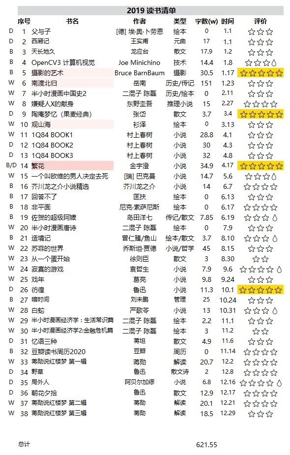
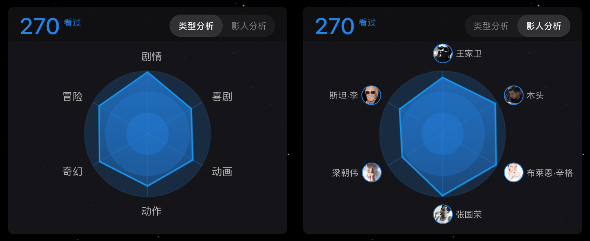
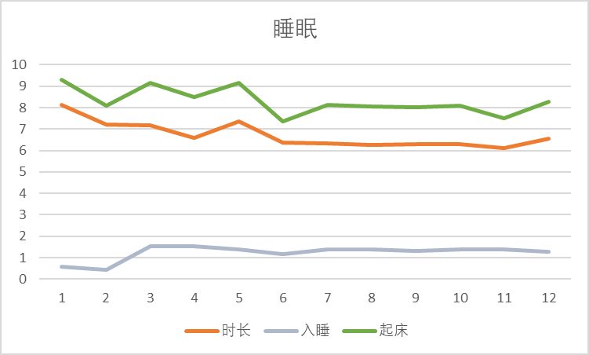
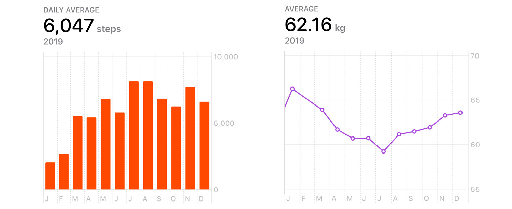
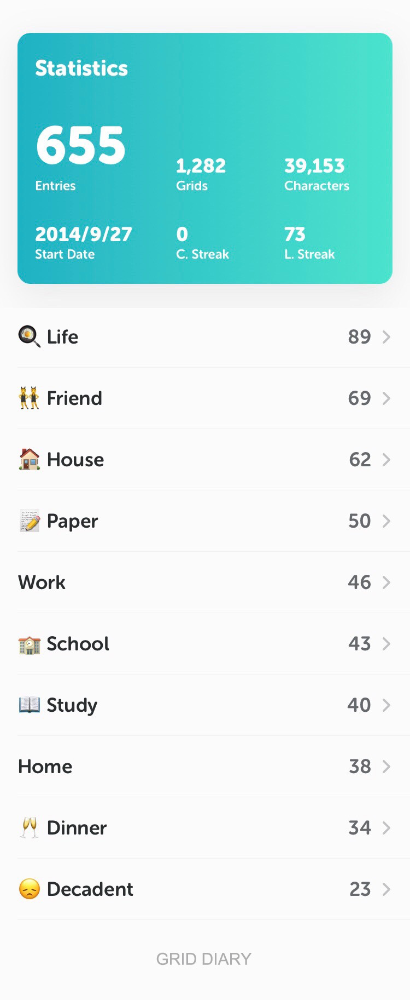
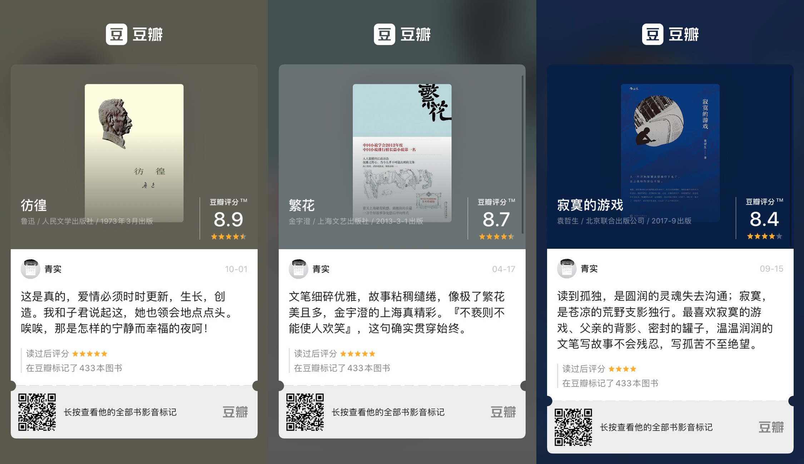
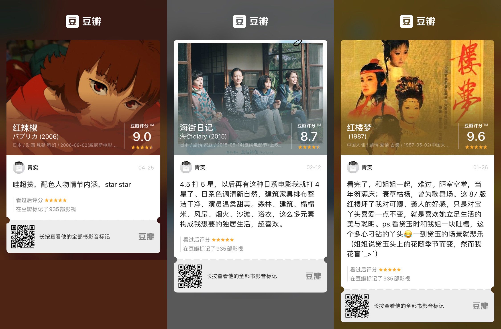

> 写在前面
>
> 2019 年渐入尾声，本以为今年的欢愉或痛苦会因为我的健忘而不起波澜。结果在年尾，有人丢石头，吓我一跳。
>
> 今年很好奇别人的爱好，想听人讲自己的经历、见解，听到感兴趣的想去尝试。只是今年新认识的人不多，认识之后交流两次问完好奇便也不知如何继续下去。所以觉得以电影去探求经历可能更轻松一点。 
>
> 看了 200 多部电影，见识了 200 种平淡或浮夸的人生。我去消遣电影情节、解构导演意图、模仿/规避剧中行为，就假设我经历过那人生的一程又一程。我花了时间去做这些消遣，最后却不知道得到了什么。也不知我这平淡无奇的人生，值得多少精巧构思来填补。
>
> 去年我说要用数据去统计、规范自己，就尽力去做了。现在做起总结，有条理有记录很轻松。以后做事大概会更加目的导向，数据驱动。有得有失。

## 正文

### 数据

- **读书 - 36 本，字数 621.55W**
- **影视 - 270 部，去掉补标应该有 220 部**
- 摄影 - 每日一记 + 游记
- 出行 - 沪宁锡常
- 体重 - 均 62.16kg
- 睡眠
  - 入睡时间：01:29
  - 睡眠时长：6h55m

#### 读书统计

#### 观影统计

#### 每日一记

#### 出行足迹

#### 睡眠数据

#### 步数&体重

#### 格志日记

#### 照片精选

### 推荐

### 遗憾

即使买了喜欢的键盘，依然没有学会盲打，且打字速度不快

9 月宣言连两个月都没撑过就宣告破产

想选出我的年度十佳摄影作品，竟然凑[不齐]( https://tuchong.com/11378380/posts )

涛哥在我转正的时候要走了

没能去看草原夜空，来年想去世界尽头的冷酷仙境

### 优点

滴答清单上完成了很多整洁的 task，一些日常习惯已养成

读书月均 3 本，继续保持

带数据逃离网站，知乎、酷安、微博（网易云、B 站在筹备），用蚂蚁宝卡塑造影分身

### 精彩瞬间

学业结束，终身学习

Been a ZTEr

跟 ZTEr 拍视频，感受到视频的乐趣

王者荣耀，蔡姬王者

去孟小越那蹭小路学姐和小代学长的饭

和我喜欢的人彻夜长谈

跟珠珠清清老师带买衣服

与小田出行，并完成我对书房的一半幻想

和蛋蛋朵朵在一起的每一刻

读完了我看过最厚[^1]的一本出版书《南渡北归》，151 万字，前后跨度约 4 年

[^1]: 《斗破苍穹》、《雪中悍刀行》，天黑请闭嘴

